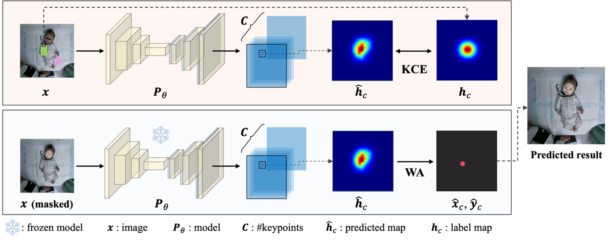

# 👶💡 Video-Based Infant Pose Estimation for Early Motor Assessment

  

This repository presents our groundbreaking work on a privacy-preserving and highly accurate video-based infant pose estimation model. Our mission? To revolutionize infant motor assessment and facilitate secure, ethical data sharing for early developmental screening! 🚀

## ✨ What Makes Our Work Special?
**Privacy-First Design**: We built a framework with HIPAA-compliant de-identification (think facial mosaicking & no facial keypoints! 🤫). This means safe data sharing without sacrificing accuracy for non-facial movements.

Infant-Specific Keypoints: We meticulously defined 22 novel infant keypoints, including palms and soles, to capture every subtle, critical movement for neurodevelopmental screening. 👣✋

See our detailed 22 keypoints:

**Public Dataset Release**: We're excited to share our curated, anonymized dataset of 238 infant videos (6,965 labeled frames!) to propel research and clinical applications forward. 💖

There are a few reference data entries in [sample_data](sample_data). If you would like to obtain the complete data, please contact us via the following email: ifchung@nycu.edu.tw

**Robust Evaluation**: We rigorously tested state-of-the-art models and introduced enhanced evaluation metrics (PCKsh and mKS) specifically tailored for infant pose assessment. Our unique metrics use anatomical references (head-to-hip, shoulder-to-shoulder) for unparalleled precision!📏

- **PCKsh**

$S=\sqrt{\left(d_{shoulder}\times d_{head-hip}\right)}$

$PCKsh@\beta=\frac{1}{C}\sum_{c=1}^{C}1\left(\sqrt{\left(x_c-{\hat{x}}_c\right)^2+\left(y_c-{\hat{y}}_c\right)^2}<\beta\cdot S\right)$

C is the total number of keypoints, ${(x}_c,\ y_c)$ and ${(\hat{x}}_c,\ {\hat{y}}_c)$ are the ground truth and predicted keypoint coordinates, respectively, and $\beta$ is the predefined threshold factor.

Visualization of the standardized length S and the PCK@0.1 evaluation region:

- **mKS**

$mKS=\frac{1}{C}\sum_{i}^{C}exp\left(-\frac{d_i^2}{2S^2\lambda}\right)$

Here, standardized length is used, and λ is a smoothing parameter. Unlike the original [OKS](https://cocodataset.org/#keypoints-eval), which uses temporal variability, we fixed λ based on clinical expert consultation and empirical determination. This ensures consistent, scale-invariant evaluation across infants, reflecting appropriate tolerance for body proportions and annotation uncertainty.

## 🌟 Our Amazing Results!
We achieved high keypoint accuracy with Simple Baseline and ResUNet models (PCKsh@0.1 > 0.93!).

**Game-Changing Loss Function**: Our Keypoint Cross Entropy (KCE) loss combined with Weighted Average (WA) decoding consistently outperformed traditional methods, giving us super stable and precise keypoint localization. 🎯

$L_{KCE}=-\frac{1}{C}\sum_{c=1}^{C}{h_clog\ {\hat{h}\prime}_c}\ ,\ \ where\ {\hat{h}\prime}_c=softmax\left({\hat{h}}_c\right)$

Here, the ground-truth heatmap $h_c$ for keypoint c is used, and a spatial softmax is applied to the predicted heatmap ${\hat{h}\prime}_c$ to create a probability distribution. This normalization centers the confidence at the predicted keypoint, with pixel values summing to one. Unlike BCE, KCE offers a more structured supervisory signal, improving spatial precision and reducing background penalization by encouraging the model to focus on relative spatial confidence.

The following table details the performance gains with KCE:

|Model |Loss |PCK@0.1|PCK@0.08 |PCK@0.06 |PCK@0.04 |PCK@0.02 |mKS |epoch time (sec)|
|-|-|-|-|-|-|-|-|-|
|Baseline |MSE |0.893/0.900 |0.850/0.849 |0.770/0.768 |0.591/0.587 |0.214/0.221 |0.822/0.822 |125 |
| |BCE |0.919/0.928 |0.881/0.881 |0.804/0.808 |0.628/0.615 |0.230/0.232 |0.848/0.859 |125 |
| |KCE |0.937/0.930 |0.903/0.897 |0.841/0.835 |0.708/0.696 |0.416/0.385 |0.879/0.870 |125 |
|Hourglass |MSE |0.804/0.796 |0.750/0.741 |0.667/0.653 |0.527/0.510 |0.280/0.265 |0.752/0.741 |321 |
| |BCE |0.836/0.830 |0.791/0.780 |0.716/0.704 |0.555/0.537 |0.216/0.210 |0.776/0.770 |321 |
| |KCE |0.837/0.829 |0.790/0.777 |0.713/0.694 |0.560/0.547 |0.317/0.284 |0.784/0.771 |321 |
|ResUnet |MSE |0.889/0.895 |0.855/0.857 |0.788/0.791 |0.635/0.630 |0.274/0.269 |0.829/0.831 |150 |
| |BCE |0.912/0.919 |0.880/0.881 |0.817/0.821 |0.658/0.650 |0.277/0.277 |0.851/0.850 |150 |
| |KCE |0.929/0.931 |0.898/0.898 |0.837/0.835 |0.709/0.707 |0.427/0.408 |0.874/0.871 |150 |

**Face Occlusion? No Problem!**: Our models prove that even with faces occluded for privacy, accuracy for body keypoints remains unaffected. This is huge for secure data sharing! 🔒

Face occlusion and labeling configurations used during training and validation. All evaluations are conducted on the 17 non-facial keypoints to isolate the effects of facial occlusion and supervision. vis. = facial region visible; occ. = facial region occluded; pres. = facial keypoints preserved; omit. = facial keypoints omitted.

|Occlusion on face |Facial keypoints |PCK@0.1|PCK@0.08 |PCK@0.06 |PCK@0.04 |PCK@0.02 |mKS |
|-|-|-|-|-|-|-|-|
|**Train/Valid** |**Label** | | | | | | |
**vis./vis.** |**pres.** |0.919/0.919 |0.877/0.879 |0.799/0.800 |0.636/0.628 |0.308/0.285 |0.851/0.848|
**vis./vis.** |**omit.** |0.921/0.921 |0.877/0.878 |0.798/0.798 |0.627/0.619 |0.292/0.270 |0.848/0.847|
**vis./occ.** |**omit.** |0.911/0.914 |0.866/0.869 |0.783/0.783 |0.611/0.607 |0.283/0.263 |0.841/0.841|
**occ./vis.** |**omit.** |0.911/0.915 |0.869/0.871 |0.785/0.779 |0.616/0.610 |0.289/0.267 |0.841/0.841|
**occ./occ.** |**omit.** |0.917/0.922 |0.875/0.880 |0.796/0.791 |0.630/0.619 |0.301/0.275 |0.849/0.847|

PCK@0.1 accuracy across individual keypoints on the testing dataset. vis. = facial region visible; occ. = facial region occluded; pres. = facial keypoints preserved; omit. = facial keypoints omitted.

|Train |Valid |Label |Vertex |Shoulder |Elbow |Wrist |Palm |Hip |Knee |Ankle |Sole |Avg.|
|-|-|-|-|-|-|-|-|-|-|-|-|-|
|**vis.** |**vis.** |**pres.** |0.950 |0.954 |0.927 |0.951 |0.929 |0.752 |0.938 |0.946 |0.943 |0.919|
|**vis.** |**vis.** |**omit.** |0.924 |0.958 |0.917 |0.952 |0.921 |0.773 |0.952 |0.959 |0.935 |0.921|
|**vis.** |**occ.** |**omit.** |0.884 |0.961 |0.909 |0.944 |0.907 |0.767 |0.951 |0.957 |0.935 |0.907|
|**occ.** |**vis.** |**omit.** |0.898 |0.949 |0.922 |0.947 |0.915 |0.762 |0.943 |0.954 |0.939 |0.915|
|**occ.** |**occ.** |**omit.** |0.921 |0.967 |0.924 |0.955 |0.921 |0.768 |0.944 |0.955 |0.940 |0.922|

PCK@0.1 comparison across different body regions under varied validation conditions:

PCK@0.1 comparison across different body regions under varied training strategies:

**Beyond the Lab**: Our model generalized beautifully to the Infant Movement Videos (IMV) dataset, proving its robustness across diverse environments, lighting, and camera angles. It even rocked on AI-generated infant images! 🌍✨

- **Keypoint Predictions on the IMV dataset**:

- **Keypoint Predictions on GPT-4o-Generated Infant Images**:

**Smoother Than Human!**: Our model's predictions showed superior temporal consistency compared to human annotations, especially for tricky areas like the hip. This means more reliable, less noisy data for clinical insights! 📈

The following figure visually compares our model's smooth predictions against human annotations:

We're excited for you to explore our work and contribute to a future where every infant's motor development can be accurately and securely assessed!
