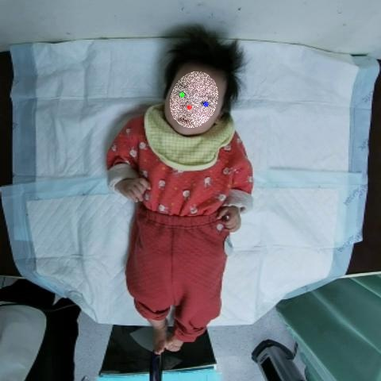

# 👶💡 Video-Based Infant Pose Estimation for Early Motor Assessment

  

This repository presents our groundbreaking work on a privacy-preserving and highly accurate video-based infant pose estimation model. Our mission? To revolutionize infant motor assessment and facilitate secure, ethical data sharing for early developmental screening! 🚀

## ✨ What Makes Our Work Special?
**Privacy-First Design**: We built a framework with HIPAA-compliant de-identification (facial mosaicking🤫). This means safe data sharing without sacrificing accuracy for non-facial movements.

**Infant-Specific Keypoints:** We meticulously defined 22 novel infant keypoints, including palms and soles, to capture every subtle, critical movement for neurodevelopmental screening. 👣✋

See our detailed 22 keypoints:

**Public Dataset Release**: We're excited to share our curated, anonymized dataset of 238 infant videos (6,965 labeled frames!) to propel research and clinical applications forward. 💖

There are a few reference data entries in [sample_data](sample_data). If you would like to obtain the complete data, please contact us via the following email: mjjeng@nycu.edu.tw

**Robust Evaluation**: We rigorously tested state-of-the-art models and introduced enhanced evaluation metrics (**PCKsh** and **mKS**) specifically tailored for infant pose assessment. Our unique metrics use anatomical references (head-to-hip, shoulder-to-shoulder) for unparalleled precision!📏

- **PCKsh**

$$S=\sqrt{\left(d_{shoulder}\times d_{head-hip}\right)}$$

$$PCKsh@\beta=\frac{1}{C}\sum_{c=1}^{C}1\left(\sqrt{\left(x_c-{\hat{x}}_c\right)^2+\left(y_c-{\hat{y}}_c\right)^2}<\beta\cdot S\right)$$

C is the total number of keypoints, ${(x}_c,\ y_c)$ and ${(\hat{x}}_c,\ {\hat{y}}_c)$ are the ground truth and predicted keypoint coordinates, respectively, and $\beta$ is the predefined threshold factor.

Visualization of the standardized length S and the PCK@0.1 evaluation region:

- **mKS**

$$mKS=\frac{1}{C}\sum_{i}^{C}exp\left(-\frac{d_i^2}{2S^2\lambda}\right)$$

Here, standardized length is used, and λ is a smoothing parameter. Unlike the original [OKS](https://cocodataset.org/#keypoints-eval), which uses temporal variability, we fixed λ based on clinical expert consultation and empirical determination. This ensures consistent, scale-invariant evaluation across infants, reflecting appropriate tolerance for body proportions and annotation uncertainty.

## 🌟 Our Amazing Results!
We achieved high keypoint accuracy on testing data with Simple Baseline and ResUNet models:

|Model             |PCK@0.1 |mKS   |Parameters |
|------------------|--------|------|-----------|
|Stacked Hourglass |0.829   |0.771 |33.08M     |
|Simple Baseline   |0.930   |0.870 |34.08M     |
|ResUNet           |0.931   |0.871 |33.87M     |

**Beyond the Lab**: Our model generalized beautifully to the Infant Movement Videos (IMV) dataset, proving its robustness across diverse environments, lighting, and camera angles. It even rocked on AI-generated infant images! 🌍✨

- **Keypoint Predictions on the IMV dataset**:

- **Keypoint Predictions on GPT-4o-Generated Infant Images**:

**Smoother Than Human!**: Our model's predictions showed superior temporal consistency compared to human annotations, especially for tricky areas like the hip. This means more reliable, less noisy data for clinical insights! 📈

The following figure visually compares our model's smooth predictions against human annotations:

We're excited for you to explore our work and contribute to a future where every infant's motor development can be accurately and securely assessed!
